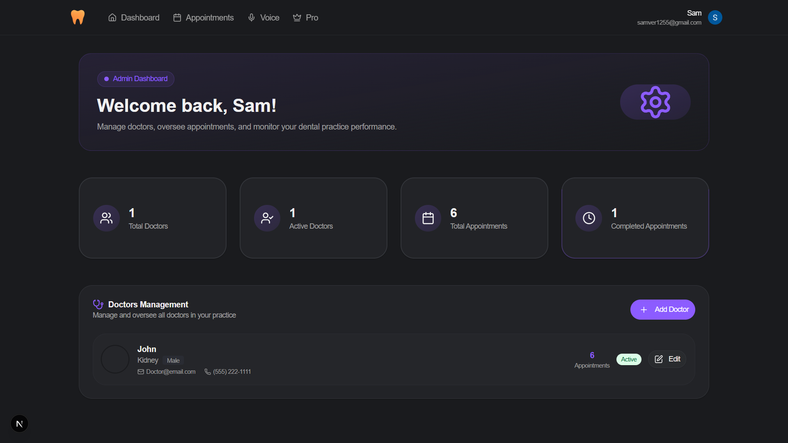
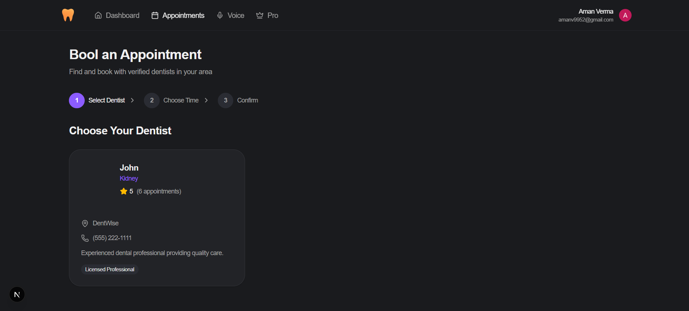
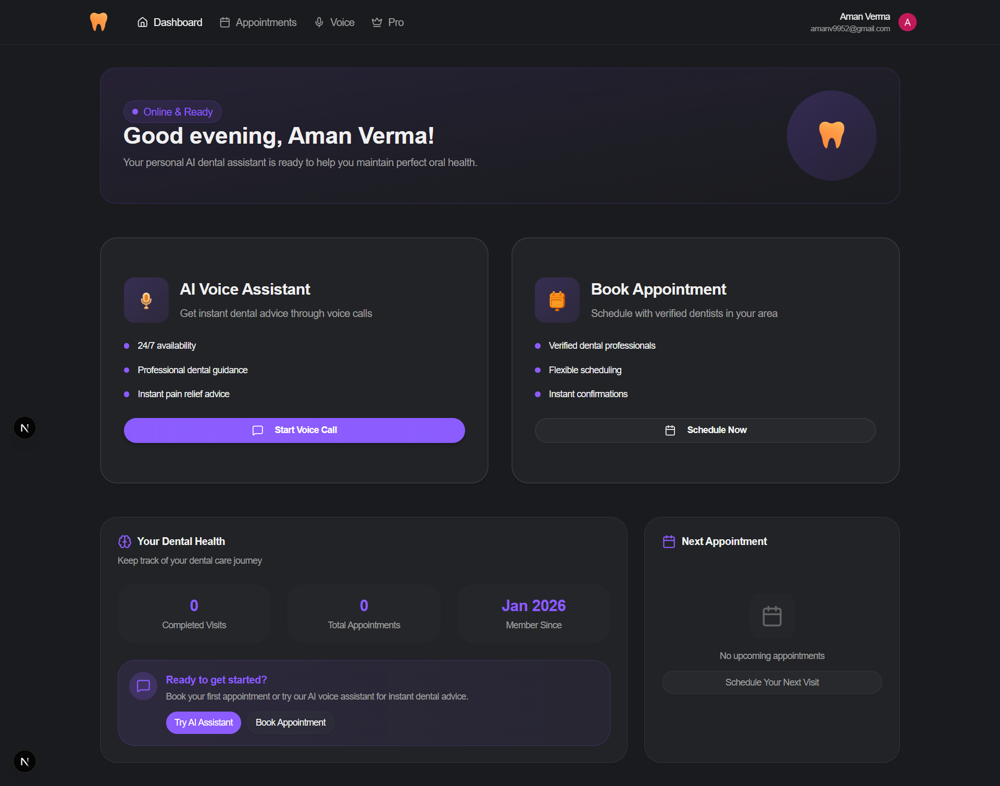
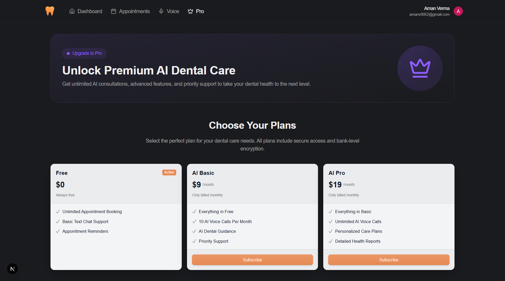
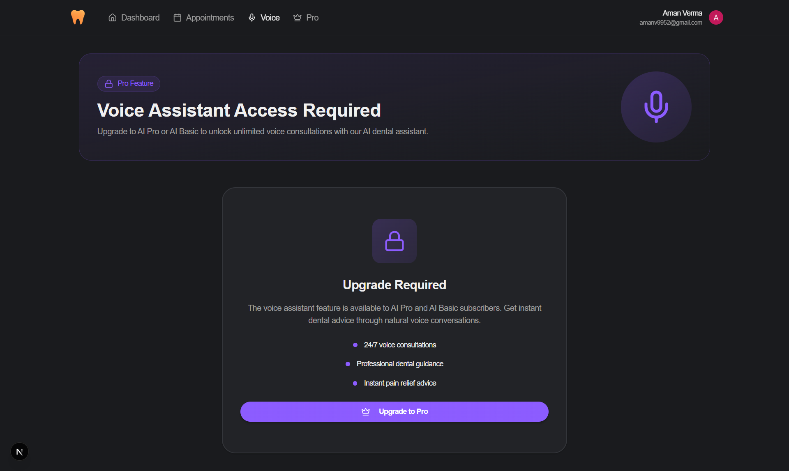

# Dentwise – Dental Platform with AI Voice Agent

Dentwise is an intelligent dental appointment and practice-management platform that combines traditional booking features with an AI voice assistant to make dental care scheduling more efficient and user-friendly. It lets patients browse dentists, book and manage appointments, and interact through a conversational voice AI agent that helps with appointment booking and basic dental inquiries using natural speech. The system also includes user and admin dashboards plus real-time updates to keep both patients and clinics in sync.

## 🚀 Features

- **Appointment Booking & Management**:Patients can book dental appointments online. Real-time status tracking (pending, confirmed, completed, cancelled).

- **AI Voice Assistant Integration**: Built-in AI voice agent for conversational interactions. Helps patients get instant responses and consult without waiting.

- **User & Admin Dashboards**: Separate interfaces for patients and clinic admins. Role-based access & secure account management.

- **Doctor Management**: Admins can add, edit or remove doctors. Dynamic control over dentist listings and profiles.

- **Automatic Notifications**: Email confirmations for bookings. Alerts for changes or updates in appointment status.

- **Modern Technical Stack (relevant for developers)**: Built with Next.js, TypeScript, Tailwind CSS, and PostgreSQL. Uses Vapi AI for voice agent support.

## 🖼️ Screenshots

### 🏠 Landing Pages


### Admin Page


### Appointment Page


### Dashboard Page


### Pro Page


### Voice Page


## 🛠️ Tech Stack

### Frontend
- **Framework**: React 19 (Next)
- **Styling**: Tailwind CSS 4 and Shadcn UI

### Backend
- **Runtime**: Node.js
- **Framework**: Express.js
- **Data Persistence**: PostgreSQL (Neon)
- **AI Engine**: Vapi
- **Authentication**: Clerk
- **Email Notification**: Resend
- **Data Fetching**: TanStack Query

---

## 🧪 .env Setup

```bash
NEXT_PUBLIC_CLERK_PUBLISHABLE_KEY=your_clerk_publishable_key
CLERK_SECRET_KEY=your_clerk_secret_key

DATABASE_URL=your_postgres_database_url

NEXT_PUBLIC_VAPI_ASSISTANT_ID=your_vapi_assistant_id
NEXT_PUBLIC_VAPI_API_KEY=your_vapi_api_key

ADMIN_EMAIL=your_admin_email

RESEND_API_KEY=your_resend_api_key

NEXT_PUBLIC_APP_URL=your_app_url

```

## Run the app

```bash
1- npm install
2- npm run dev
```

## 🤝 Contributing
Contributions are welcome! Please feel free to submit a Pull Request.

<!-- ---
Developed as a **Final Year Project** for advanced AI-driven career tools. -->
